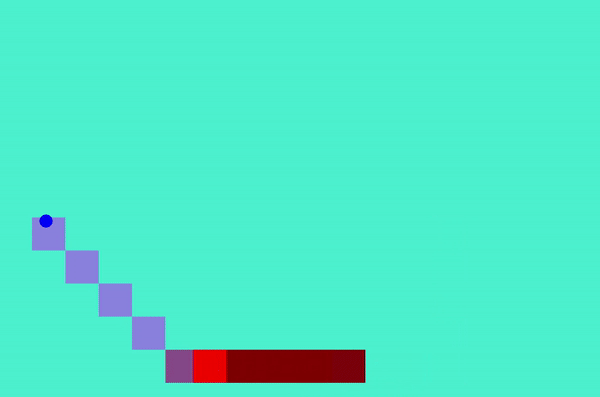

# Computer Programming Project 	
## University of Bristol, Dec 2018 – Jan 2019
*	Individual assignment to showcase Python skills learned from the Introduction to Computer programming unit
*	Created a game environment that contained; a user-controlled player, an enemy that paths towards the player whilst avoiding obstacles that the player can draw on the screen 
*	Coded from scratch a pathfinding algorithm, inspired by Dijkstra’s algorithm, that was designed to handle multiple end points (e.g. players) and the ability to find the shortest path even through portal mechanics 
*	Used prior mathematical knowledge to code mechanics such as player movement using the equations of motion in vector form and using vectors to detect collisions between the game objects
*	Demonstrated higher level understanding and good programming practises such as through; object orientated programming (classes and class inheritance), standard naming conventions for variables, using a variety of data structures and data types
*	Assignment feedback - “Original take on an avoidance game, good understanding of more complex ideas in Python, good code structure by using classes, implemented interesting mechanics into PyGame such as wall drawing and pathfinding.”

## How to play
### Installation and running
I ran my python program on Windows 10 within the Pycharm IDE. To run the program you will need to have python 3 installed and the pygame module. I am not sure whether it would run on Linux or MacOS. I would recommend playing the game demo version over the game submission version because it runs smoother. The submission version contains portals that can cause bugs and crashes, it also contains more visual effects when the enemy triggers the pathfinder algorithmic function which slows down computer performance. 

### Controls
The controls are very simple, use the WASD keys to move in a direction. Move your mouse and left click to draw walls onto the screen. You could alternatively use a touch screen device and draw walls that way. 

### Other notes
The player has a lot of health in the game demo version. You can manually change this in the code just by reducing the health value under the player class. You can also play around with, for example, velocity values for the player and enemy classes. 

## How the pathfinder works

